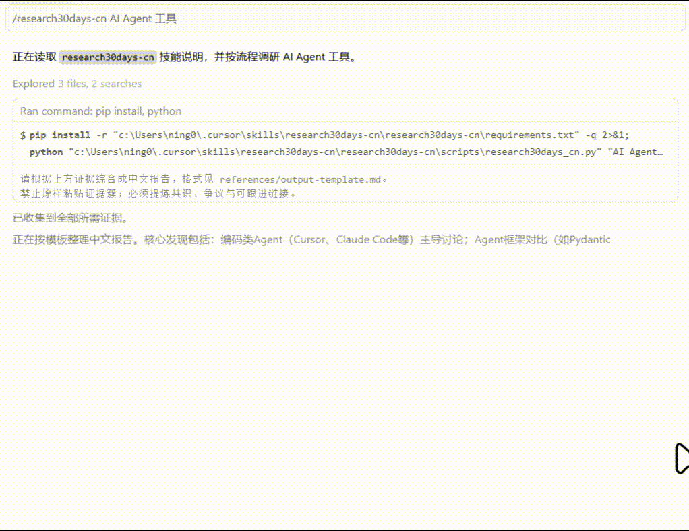

# research30days-cn

[简体中文](./README.md) | [English](./README.en.md) | [繁體中文](./README.zh-TW.md) | **日本語** | [한국어](./README.ko.md) | [Español](./README.es.md) | [Français](./README.fr.md) | [Deutsch](./README.de.md) | [Português](./README.pt.md) | [Русский](./README.ru.md)

**中国語マルチソース調査 Agent Skill** — ワンコマンドで、知乎・Bilibili・少数派・中国語ウェブ全体から過去 30 日間の話題を調査し、構造化された中国語レポートを出力します。



> [last30days-skill](https://github.com/mvanhorn/last30days-skill) に着想を得て、中国語インターネットのデータソースに特化。

## クイックスタート

### 1. 依存関係のインストール

```bash
pip install -r requirements.txt
```

### 2. エンジンの実行

```bash
python skills/research30days-cn/scripts/research30days_cn.py "AI Agent ツール" --emit compact
```

### 3. Cursor での利用

Skill を Cursor にインストール：

```bash
# Windows PowerShell
Copy-Item -Recurse skills/research30days-cn "$env:USERPROFILE\.cursor\skills\research30days-cn"

# macOS / Linux
cp -r skills/research30days-cn ~/.cursor/skills/research30days-cn
```

Cursor で次のように入力：

```
/research30days-cn Cursor AI コーディングツール
```

または自然言語で：

```
過去30日間、中国語コミュニティで「インディーハッカーの海外展開」について何が議論されているか調査して
```

## 出力例

エンジンが証拠クラスタを返し、Agent が次のようなレポートに統合します：

```
🇨🇳 research30days-cn v0.1.0 · synced 2026-06-19

## 调研摘要
近 30 天中文社区对 AI Agent 工具的讨论集中在...

## 社区共识
1. **Cursor + MCP 成为默认组合** - ...
```

> レポートは**中国語**で出力されます — 本 Skill は中国語ソースと読者向けに設計されています。

## データソース

| ソース | キー | 説明 |
|--------|------|------|
| ウェブ全体 | `web` | DuckDuckGo（中国語リージョン） |
| 知乎 (Zhihu) | `zhihu` | `site:zhihu.com` |
| Bilibili | `bilibili` | API + `site:bilibili.com` フォールバック |
| 少数派 (SSPAI) | `sspai` | `site:sspai.com` |

## CLI オプション

```bash
python skills/research30days-cn/scripts/research30days_cn.py "トピック" [オプション]

  --days 30              遡及日数
  --sources web,zhihu,bilibili   ソース限定
  --max-results 8        ソースあたりの最大件数
  --emit compact|json|md 出力形式
  --save ~/.research30days       生レポートの保存先
```

## プロジェクト構成

```
skills/research30days-cn/
├── SKILL.md                 # Agent スキル契約
├── references/
│   └── output-template.md   # レポート出力テンプレート
└── scripts/
    ├── research30days_cn.py # CLI エントリポイント
    └── lib/
        ├── sources.py       # マルチソース検索
        ├── render.py        # 出力レンダリング
        └── schema.py        # データモデル
```

## 対応プラットフォーム

オープン [Agent Skills](https://agentskills.io) 形式に準拠：

- Cursor
- Claude Code
- Codex CLI
- GitHub Copilot

## 開発

```bash
pip install -e ".[dev]"
pytest tests/
```

## License

MIT
